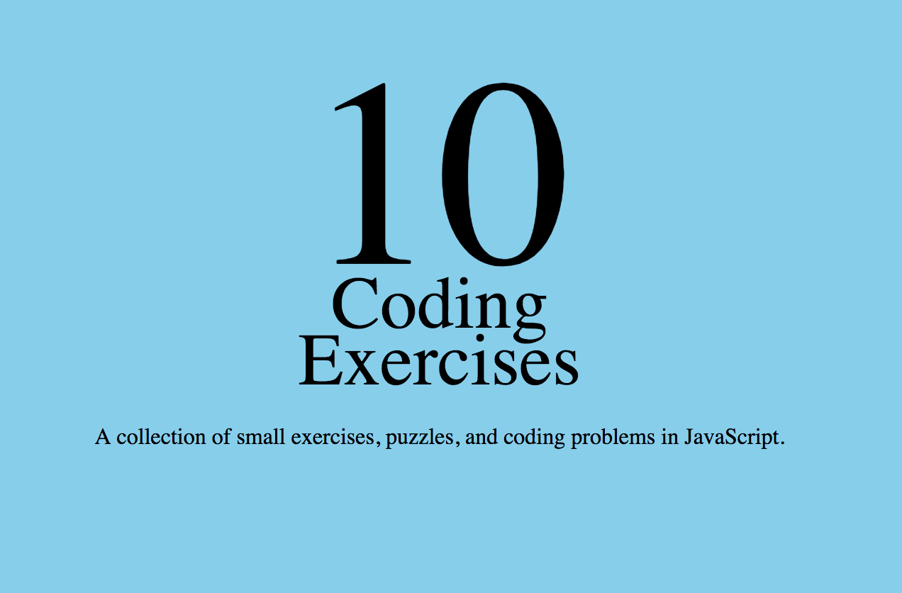

# Coding Exercises in JavaScript
A collection of small exercises, puzzles, and coding problems in JavaScript.



## Run Program

Clone down the repo and navigate to the root directory of the project, when inside run the following commands:

```
  $ npm install
  $ npm build
  $ npm start
```
